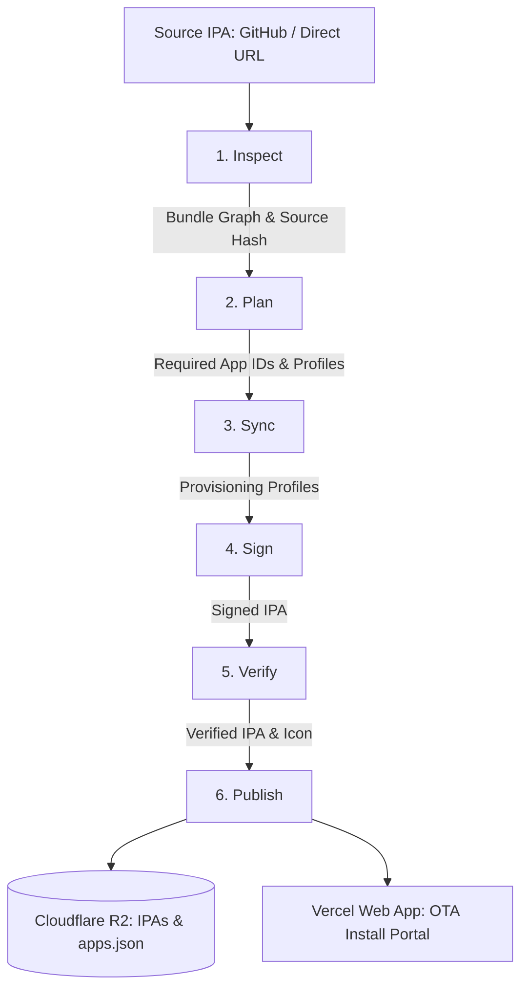

# Architecture Overview

SideloadedIPA is an automated pipeline that downloads, provisions, signs, verifies, and distributes iOS IPAs. It is designed to handle complex applications containing nested app extensions, custom entitlement policies, and shared App Groups.

---

## Pipeline Stages

The pipeline executes in six ordered stages. Each stage produces a structured manifest in `work/pipeline/<run-id>/` that validates the inputs and guarantees deterministic execution.

### 1. Inspect (`inspect`)
- Downloads the source IPA from a direct HTTPS URL (validated against a pinned SHA-256) or the latest matching asset from a GitHub release.
- Validates the ZIP archive against traversal attacks and corruption.
- Recursively scans the bundle hierarchy to detect the root app, app extensions (`.appex`), and embedded frameworks.
- Extracts existing Info.plist metadata and original entitlements.

### 2. Plan (`plan`)
- Evaluates the bundle graph against `configs/tasks.toml` configuration.
- Calculates target bundle identifiers and required Apple capabilities (e.g., App Groups, HealthKit, Increased Memory Limit).
- Inspects the Apple Developer Portal (via App Store Connect API) to determine which App IDs, capabilities, and provisioning profiles need to be created or updated.
- **Read-only**: makes no changes to Apple Developer resources.

### 3. Sync (`sync --apply`)
- Automatically creates missing App IDs and enables required capabilities in the Apple Developer Portal.
- Generates and downloads iOS development provisioning profiles for each profile-bearing bundle.
- **Safe & Additive**: Only creates missing resources; never deletes existing App IDs or revokes certificates.

### 4. Sign (`sign`)
- Generates tailored entitlement plists for each bundle based on configured entitlement modes (`profile`, `template`, or `preserve-source`).
- Signs the bundle hierarchy in **bottom-up order** (deepest nested extensions/frameworks first, root application last) using patched `zsign`.
- Supports smart caching: if source bytes, bundle rules, and profile fingerprints are unchanged, re-signing is skipped.

### 5. Verify (`verify`)
- Reopens the newly signed (or cached) IPA in an isolated workspace.
- Validates Mach-O code signatures for every binary and framework in the bundle tree.
- Verifies that embedded provisioning profiles match the signing certificate and team.
- Checks consistency between XML and DER entitlement representations.

### 6. Publish (`publish`)
- Uploads verified IPAs and extracted app icons to Cloudflare R2 under immutable, versioned keys (`apps/<slug>/<version>/...`).
- Atomically updates the central `site/apps.json` registry file on R2.
- Triggers on-demand cache revalidation on the Next.js web application via `/api/revalidate`.
- Safely cleans up obsolete IPA and icon versions from R2 after successful publication.

---

## Caching Model

SideloadedIPA uses content-addressed caching to avoid unnecessary signing in CI:

1. **Fingerprint Calculation**: A SHA-256 fingerprint is computed from:
   - Source IPA digest and bundle graph structure.
   - Signing policy and entitlement templates.
   - Apple provisioning profile IDs and certificate serial numbers.
   - Patched `zsign` binary version and checksum.
2. **Cache Verification**: When a cache entry matches, the pipeline checks that the certificate and profiles are still valid, then runs the full independent `verify` stage on the cached IPA.
3. **Publication Gate**: Cached builds are only published after passing the complete verification gate.

---

## Web Distribution & OTA Portal

The repository includes a Next.js front-end in `web/` that provides an Over-The-Air (OTA) installation portal:

- **Data Source**: Reads the validated `site/apps.json` registry from Cloudflare R2.
- **OTA Manifests**: Serves dynamic `/apps/[slug]/itms.plist` endpoints formatted for iOS Safari's `itms-services://` protocol.
- **Cache & Revalidation**: Uses Next.js data cache tagged with `apps`. When the pipeline publishes new builds, it calls `/api/revalidate` with `X-Revalidate-Secret` to refresh the catalog immediately without full site redeploys.

